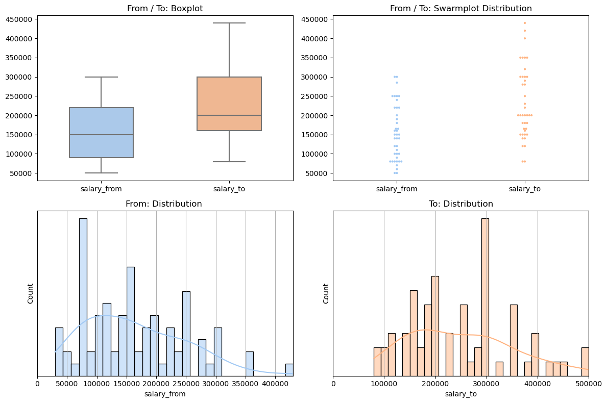
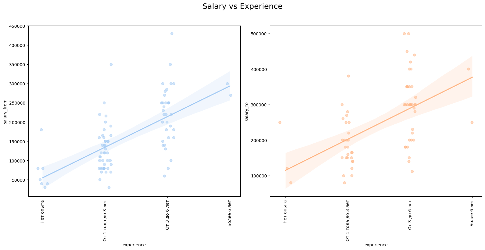
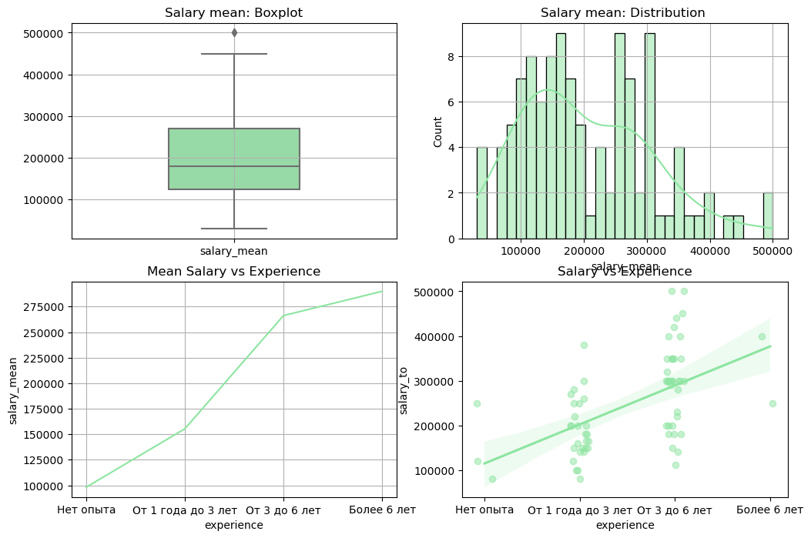
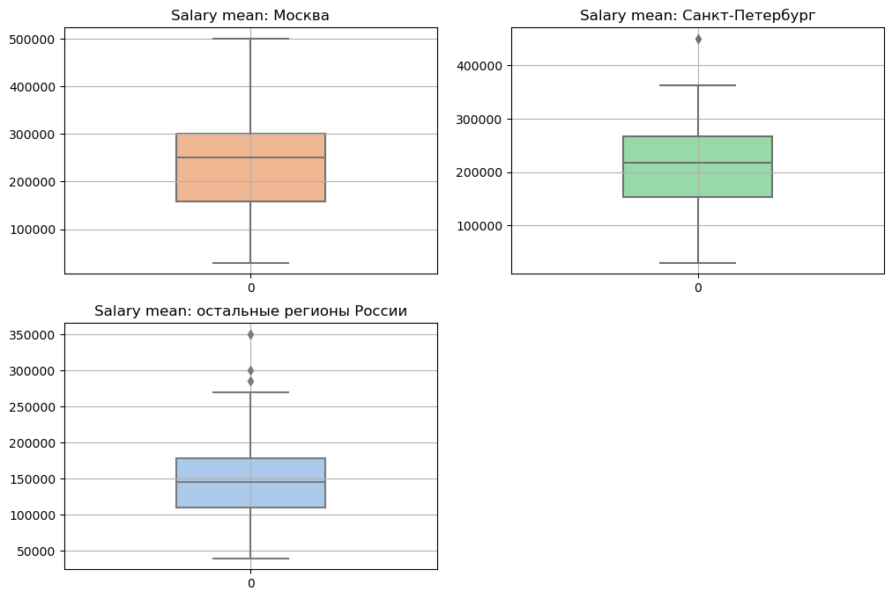

<a id="task"></a>
## Задачи
Обработать данные о вакансиях. Проанализировать зарплаты и посмотреть на зависимости.

Составить ТОПы ключевых навыков и самых часто повторяющихся слов в описаниях вакансий. Определить отличия навыков в зависимости от уровня профессионализма. 

<a id="data_processing"></a>
## Анализ данных
Собранны данные по запросу 
- профессия - все вакансии в которых в названии которых есть слово `Android`
- район поиска - `Россия`


```
    RangeIndex: 524 entries, 0 to 523
    Data columns (total 17 columns):
     #   Column        Non-Null Count  Dtype  
    ---  ------        --------------  -----  
     0   id            524 non-null    int64  
     1   premium       524 non-null    bool   
     2   vacancy_name  524 non-null    object 
     3   city          524 non-null    object 
     4   salary        524 non-null    bool   
     5   salary_from   116 non-null    float64
     6   salary_to     94 non-null     float64
     7   currency      145 non-null    object 
     8   experience    524 non-null    object 
     9   schedule      524 non-null    object 
     10  employment    524 non-null    object 
     11  description   524 non-null    object 
     12  skills        347 non-null    object 
     13  employer      524 non-null    object 
     14  publish_date  524 non-null    object 
     15  vacancy_url   524 non-null    object 
     16  has_test      524 non-null    bool   
```

    

В таблице есть пропуски в данных о зарплате и ключевых умениях. Остальные данные заполнены полностью. Связано это с тем что на сервисе hh.ru столбцы в которых есть пропуски не являются обязательными к заполнению.

<a id="data_salary_from_to"></a>
### Распределие зарплат "от/до"

    | Describe |
    |       | salary_from   |||       | salary_to   |
    |:------|:--------------|||:------|:------------|
    | count | 85            ||| count | 67          |
    | mean  | 162,600       ||| mean  | 248,978     |
    | std   | 84,483        ||| std   | 103,497     |
    | min   | 30,000        ||| min   | 80,000      |
    | 25%   | 90,000        ||| 25%   | 165,000     |
    | 50%   | 150,000       ||| 50%   | 250,000     |
    | 75%   | 220,000       ||| 75%   | 300,000     |
    | max   | 430,000       ||| max   | 500,000     |
    


    

    


По графикам видно:


Ожидаемо видно что чем выше зарплата тем меньше вакансий.

<a id="data_salary_to_lvl"></a>
### Зависимость зарплаты "от/до" от опыта
    

    


По графикам можно определить:
- больше всего вакансий с требованием опыта `от 1 до 3` и `от 3 до 6`
- хорошо видна корреляция `чем больше опыта, тем выше зарплата`

<a id="data_salary_mean"></a>
### Анализ сренего зраплаты
   

    


<a id="data_salary_conclusion"></a>
### Вывод
Проанализировав данные по `от/до` и `среднего по ним` зарплат.

<a id="data_salary_city"></a>
### Зависимость зарплаты от города

Для анализа зависимости зарплаты от города, для начала найдем топ 10 самых частых городов в датафрейме.


<div>
<table class="dataframe">
  <thead>
    <tr style="text-align: right;">
      <th>city</th>
      <th>vacancy_count</th>
    </tr>
  </thead>
  <tbody>
    <tr>
      <th>Москва</th>
      <td>266</td>
    </tr>
    <tr>
      <th>Санкт-Петербург</th>
      <td>90</td>
    </tr>
    <tr>
      <th>Новосибирск</th>
      <td>17</td>
    </tr>
    <tr>
      <th>Казань</th>
      <td>12</td>
    </tr>
    <tr>
      <th>Нижний Новгород</th>
      <td>10</td>
    </tr>
    <tr>
      <th>Екатеринбург</th>
      <td>8</td>
    </tr>
    <tr>
      <th>Ростов-на-Дону</th>
      <td>8</td>
    </tr>
    <tr>
      <th>Томск</th>
      <td>5</td>
    </tr>
    <tr>
      <th>Калининград</th>
      <td>4</td>
    </tr>
    <tr>
      <th>Краснодар</th>
      <td>4</td>
    </tr>
  </tbody>
</table>
</div>


В топ 10 ожидаемо и с огромным перевесом, попала Москва и Петербург. А так же другие города миллионники. Для анализа возьмем следующие срезы:
- Москва
- Петербург
- все остальные города

    

    


<a id="data_salary_city_conclusion"></a>
### Вывод
По графикам видна разница зарплат в Москве и Петербурге и остальных регионах России.

<a id="data_skills_description"></a>
## Анализ навыков и описания вакансий


Список самых часто встречающихся:
- ключевых навыков
- повторяющихся англ слов в описании вакансий
- повторяющихся рус слов в описании вакансий

```

    | Main skills |
    |    | skills          |   count |||    | words_en     | count   |||    | words_ru    | count   |
    |---:|:----------------|--------:|||---:|:-------------|:--------|||---:|:------------|:--------|
    |  0 | kotlin          |     263 |||  0 | android      | 1,342   |||  0 | опыт        | 1,702   |
    |  1 | android         |     252 |||  1 | kotlin       | 700     |||  1 | работы      | 1,333   |
    |  2 | android sdk     |     159 |||  2 | java         | 304     |||  2 | разработки  | 815     |
    |  3 | java            |     143 |||  3 | sdk          | 255     |||  3 | приложений  | 698     |
    |  4 | git             |      84 |||  4 | mvvm         | 247     |||  4 | знание      | 653     |
    |  5 | mvvm            |      52 |||  5 | git          | 246     |||  5 | приложения  | 542     |
    |  6 | ооп             |      38 |||  6 | coroutines   | 194     |||  6 | понимание   | 508     |
    |  7 | rxjava          |      28 |||  7 | dagger       | 180     |||  7 | будет       | 407     |
    |  8 | retrofit        |      26 |||  8 | compose      | 166     |||  8 | работать    | 391     |
    |  9 | coroutines      |      26 |||  9 | api          | 165     |||  9 | возможность | 391     |
    | 10 | dagger 2        |      24 ||| 10 | architecture | 163     ||| 10 | компании    | 386     |
    | 11 | ios             |      21 ||| 11 | rxjava       | 153     ||| 11 | умение      | 330     |
    | 12 | mvp             |      18 ||| 12 | mvi          | 150     ||| 12 | разработка  | 305     |
    | 13 | sql             |      17 ||| 13 | jetpack      | 144     ||| 13 | работа      | 291     |
    | 14 | английский язык |      17 ||| 14 | gradle       | 140     ||| 14 | команде     | 289     |
    | 15 | gradle          |      16 ||| 15 | retrofit     | 139     ||| 15 | мобильных   | 288     |
    | 16 | rest            |      16 ||| 16 | code         | 130     ||| 16 | задачи      | 262     |
    | 17 | c++             |      15 ||| 17 | clean        | 125     ||| 17 | плюсом      | 251     |
    | 18 | jetpack compose |      15 ||| 18 | ios          | 123     ||| 18 | участие     | 233     |
    | 19 | dagger          |      14 ||| 19 | solid        | 121     ||| 19 | команды     | 231     |
```    

<a id="data_skills_to_lvl"></a>
### Сравнение ключевых навыков между уровнями вакансий
Сравниваем ключевые навыки и самые часто повторяющиеся англ слова в вакансиях в зависимости от уровня работника
- junior - "Нет опыта"
- middle - "От 1 года до 3 лет"
- senior - "От 3 до 6 лет"
- lead - "Более 6 лет"


Топ ключевых навыков и самых часто встречающихся слова в описании вакансий для уровня JUNIOR (по убыванию)
```
    | Main skills for JUNIOR |
    |    | skills          |   count |||    | words_en   |   count |||    | words_ru   |   count |
    |---:|:----------------|--------:|||---:|:-----------|--------:|||---:|:-----------|--------:|
    |  0 | android         |      10 |||  0 | android    |      37 |||  0 | приложений |      21 |
    |  1 | kotlin          |       8 |||  1 | kotlin     |      24 |||  1 | опыт       |      16 |
    |  2 | ооп             |       3 |||  2 | api        |       7 |||  2 | разработки |      14 |
    |  3 | rx              |       2 |||  3 | room       |       6 |||  3 | данных     |      13 |
    |  4 | git             |       2 |||  4 | java       |       6 |||  4 | проект     |      12 |
    |  5 | java            |       2 |||  5 | for        |       6 |||  5 | системы    |      12 |
    |  6 | android sdk     |       2 |||  6 | etc        |       5 |||  6 | приложения |      12 |
    |  7 | английский язык |       1 |||  7 | git        |       5 |||  7 | разработка |      12 |
    |  8 | api             |       1 |||  8 | ios        |       5 |||  8 | работа     |      12 |
    |  9 | json api        |       1 |||  9 | react      |       4 |||  9 | работать   |      12 |
```
Топ ключевых навыков и самых часто встречающихся слова в описании вакансий для уровня MIDDLE (по убыванию)
``` 
    | Main skills for MIDDLE |
    |    | skills          |   count |||    | words_en     |   count |||    | words_ru    |   count |
    |---:|:----------------|--------:|||---:|:-------------|--------:|||---:|:------------|--------:|
    |  0 | android         |      82 |||  0 | android      |     406 |||  0 | опыт        |     488 |
    |  1 | kotlin          |      79 |||  1 | kotlin       |     198 |||  1 | работы      |     436 |
    |  2 | android sdk     |      47 |||  2 | java         |     117 |||  2 | знание      |     232 |
    |  3 | java            |      47 |||  3 | sdk          |      78 |||  3 | приложений  |     226 |
    |  4 | git             |      31 |||  4 | mvvm         |      64 |||  4 | разработки  |     219 |
    |  5 | mvvm            |      17 |||  5 | coroutines   |      62 |||  5 | понимание   |     165 |
    |  6 | ооп             |      14 |||  6 | git          |      61 |||  6 | приложения  |     138 |
    |  7 | retrofit        |      11 |||  7 | api          |      52 |||  7 | компании    |     134 |
    |  8 | английский язык |       8 |||  8 | dagger       |      48 |||  8 | возможность |     112 |
    |  9 | mvp             |       8 |||  9 | architecture |      44 |||  9 | будет       |     106 |
```
Топ ключевых навыков и самых часто встречающихся слова в описании вакансий для уровня SENIOR (по убыванию)
``` 
    | Main skills for SENIOR |
    |    | skills      |   count |||    | words_en   |   count |||    | words_ru    | count   |
    |---:|:------------|--------:|||---:|:-----------|--------:|||---:|:------------|:--------|
    |  0 | kotlin      |     163 |||  0 | android    |     811 |||  0 | опыт        | 1,101   |
    |  1 | android     |     150 |||  1 | kotlin     |     451 |||  1 | работы      | 818     |
    |  2 | android sdk |      99 |||  2 | mvvm       |     174 |||  2 | разработки  | 539     |
    |  3 | java        |      85 |||  3 | git        |     170 |||  3 | приложений  | 424     |
    |  4 | git         |      48 |||  4 | java       |     164 |||  4 | знание      | 383     |
    |  5 | mvvm        |      33 |||  5 | sdk        |     161 |||  5 | приложения  | 357     |
    |  6 | rxjava      |      19 |||  6 | mvi        |     122 |||  6 | понимание   | 306     |
    |  7 | ооп         |      18 |||  7 | coroutines |     121 |||  7 | будет       | 283     |
    |  8 | coroutines  |      18 |||  8 | dagger     |     119 |||  8 | работать    | 264     |
    |  9 | dagger 2    |      17 |||  9 | compose    |     115 |||  9 | возможность | 254     |
```
Топ ключевых навыков и самых часто встречающихся слова в описании вакансий для уровня LEAD (по убыванию)
```    
    | Main skills for LEAD |
    |    | skills          |   count |||    | words_en     |   count |||    | words_ru   |   count |
    |---:|:----------------|--------:|||---:|:-------------|--------:|||---:|:-----------|--------:|
    |  0 | kotlin          |      13 |||  0 | android      |      88 |||  0 | опыт       |      97 |
    |  1 | android sdk     |      11 |||  1 | kotlin       |      27 |||  1 | работы     |      68 |
    |  2 | android         |      10 |||  2 | java         |      17 |||  2 | разработки |      43 |
    |  3 | java            |       9 |||  3 | and          |      16 |||  3 | приложения |      35 |
    |  4 | aosp            |       4 |||  4 | aosp         |      14 |||  4 | понимание  |      30 |
    |  5 | sqlite          |       3 |||  5 | sdk          |      13 |||  5 | знание     |      28 |
    |  6 | jetpack compose |       3 |||  6 | architecture |      12 |||  6 | приложений |      27 |
    |  7 | ооп             |       3 |||  7 | compose      |      11 |||  7 | новые      |      19 |
    |  8 | c++             |       3 |||  8 | premium      |      10 |||  8 | решения    |      19 |
    |  9 | git             |       3 |||  9 | dagger       |      10 |||  9 | чтобы      |      19 |
```   